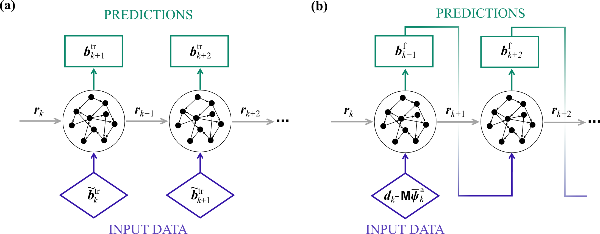

# Bias estimators

## Summary

**File:** `src/bias_estimators/bias.py`

Base class for observation-bias estimators. Mixes in `HistoryTracker`. Wraps a `forecaster` model to produce bias corrections at each assimilation step.

**Key attributes:** `innovation`, `dt`, `forecaster`, `Nq`, `N_dim`, `upsample`, `biased_observations`

Subclasses must implement:
- `init_forecaster(**kwargs)` — build/train the internal forecasting model
- `state_derivative()` — return the Jacobian `J = db/dy` used by bias-aware filters

```
Bias
├── ESN_bias
└── ConstantBias
    └── NoBias
```

| Class | File | Notes |
|---|---|---|
| `ESN_bias` | `src/bias_estimators/esn.py` | Correlation-based training; `biased_observations = True` |
| `ConstantBias` | `src/bias_estimators/constantbias.py` | Persistent bias, reset to the latest innovation each analysis step |
| `NoBias` | `src/bias_estimators/constantbias.py` | `ConstantBias` fixed at zero; unbiased-limit placeholder |

### Forecaster

The `forecaster` attribute of a `Bias` instance is a `Model` subclass — typically a data-driven model trained on the residual between observations and model output.

```
Bias instance
  .forecaster  →  Model instance   (usually ESN_model)
```

The forecaster is initialised inside `init_forecaster()` and stepped forward in sync with the main model during `Estimator.forecast_step()`. Its output is the predicted bias `b(t)`, which enters the analysis step as a correction to the observation.

<figure markdown>
  { width="700" }
  <figcaption>Basic configuration of the ESN bias estimator: the reservoir forecasts
  the innovation between observations.</figcaption>
</figure>

------

::: romda.bias_estimators.Bias

::: romda.bias_estimators.ESN_bias

::: romda.bias_estimators.ConstantBias

::: romda.bias_estimators.NoBias


::: romda.bias_estimators.aux.create_bias_training_dataset

::: romda.bias_estimators.aux.sample_model_states

::: romda.bias_estimators.plot_train_data
