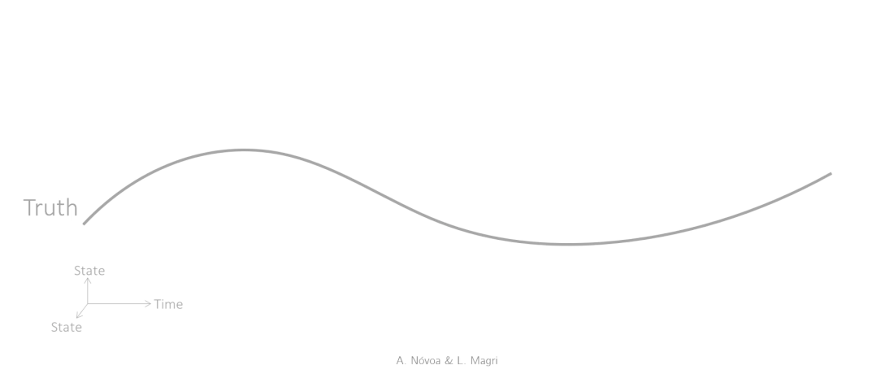

# Estimators (data assimilation)

## Summary

**File:** `src/estimators/__init__.py`

Abstract base class (ABC) that wraps a `Model` and an optional `Bias` into a full DA loop. Provides the shared `forecast_step()` that advances both the model and the bias in time.

**Key attributes:** `est_phi`, `est_alpha`, `est_bias`, `inflation_factor`, `num_DA_blind`, `num_SE_only`

**Key concrete methods:** `forecast_step()`, `_init_bias()`, `_MA()` (applies measurement operator `M`)

Subclasses must implement:
- `analysis_step(d, Cdd)` — Bayesian update given observation vector `d` and noise covariance `Cdd`

```
Estimator  (ABC)
├── EnsembleEstimator            → Stochastic filters
│   ├── EnKF
│   ├── EnSRKF
│   └── rBA_EnKF
└── DeterministicEstimator       → Deterministic filters
    └── KalmanFilter
```

The relationship between the three main classes — attributes, not subclasses:

```
Estimator instance
  .model  →  Model instance   (used for the forecast)
  .bias   →  Bias instance    (optional; None if bias-unaware)
             .forecaster  →  Model instance   (usually an ESN_model)
```

See [Stochastic filters](filter_stochastic.md) and [Deterministic filters](filter_deterministic.md)
for the concrete implementations.

<figure markdown>
  { width="700" }
  <figcaption>The real-time assimilation cycle: forecast, analysis, repeat.</figcaption>
</figure>

------

::: romda.estimators.Estimator
