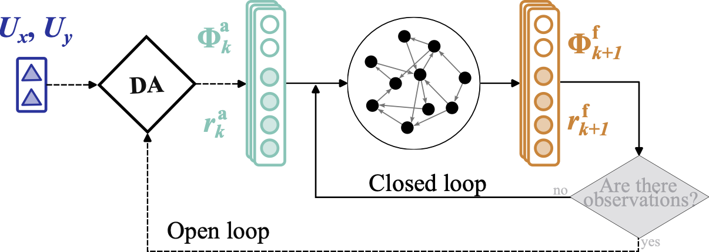
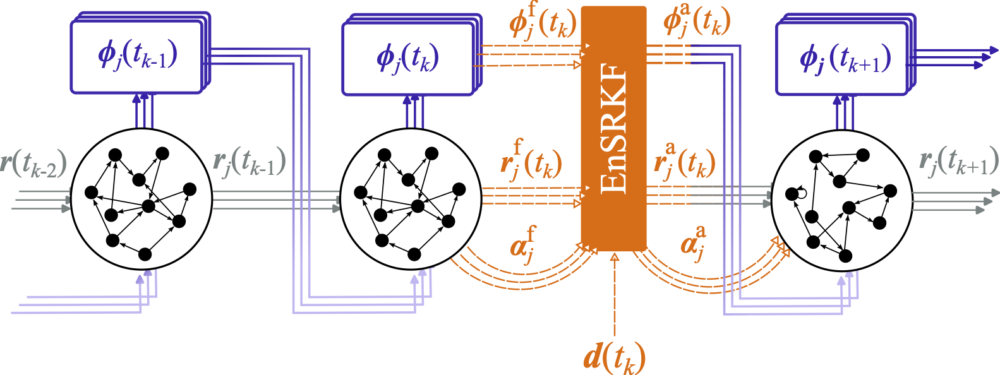

# Data-driven models

## Summary

**File:** `src/models/data_driven/`. All use `DiscreteIntegrator`. `ESN_model` mixes in
`EchoStateNetwork` — the reservoir core from the external
[`echostatenetwork`](https://andreanovoa.github.io/EchoStateNetwork/) package (re-exported by
`romda.models.data_driven` for convenience; see its own documentation for the reservoir API) —
and `POD_ESN` mixes in `ESN_model` and [`POD`](#modal-decompositions-projectors).

| Class | Key parameters | Notes |
|---|---|---|
| `ESN_model` | `N_units`, `rho`, `sigma_in`, `N_wash` | Inherits `EchoStateNetwork`; requires training `data` at init |
| `POD_ESN` | `N_modes`, `sensor_locations` | Inherits `ESN_model` + `POD`; sensor placement via QR |
| `LinearModel` | `F` (transition matrix), `Q_noise` | $\boldsymbol{\psi}_{t+1} = \mathbf{F}\boldsymbol{\psi}_t + \boldsymbol{\eta}_t$ |

The `Projector` hierarchy (`POD`/`SPOD`) and the standalone decomposition functions
(`pod_utils.py`) live in the `autoencoders/` subpackage and are documented
[below](#modal-decompositions-projectors). Import everything from `romda.models.data_driven`
(or its `autoencoders` subpackage).

<figure markdown>
  { width="700" }
  <figcaption>Open-loop (training/washout) vs. closed-loop (forecasting) reservoir
  configurations.</figcaption>
</figure>

------

## Forecast models

::: romda.models.data_driven.esn.ESN_model

::: romda.models.data_driven.pod_esn.POD_ESN

<figure markdown>
  { width="700" }
  <figcaption>State estimation via data assimilation on a POD-ESN reduced-order model.</figcaption>
</figure>

<figure markdown>
  { width="700" }
  <figcaption>Joint state and parameter estimation on the POD-ESN.</figcaption>
</figure>

::: romda.models.data_driven.linear_model.LinearModel

------

## Modal decompositions (projectors)

::: romda.models.data_driven.autoencoders.Projector

::: romda.models.data_driven.autoencoders.POD

::: romda.models.data_driven.autoencoders.SPOD

::: romda.models.data_driven.autoencoders.pod_utils.snapshot_pod

::: romda.models.data_driven.autoencoders.pod_utils.snapshot_pod_randomized

::: romda.models.data_driven.autoencoders.pod_utils.spod_sieber

::: romda.models.data_driven.autoencoders.pod_utils.spod_towne

::: romda.models.data_driven.autoencoders.pod_utils.spod_towne_reconstruct

::: romda.models.data_driven.autoencoders.pod_utils.print_spod_towne_summary

::: romda.models.data_driven.autoencoders.pod_utils.energy_fraction

