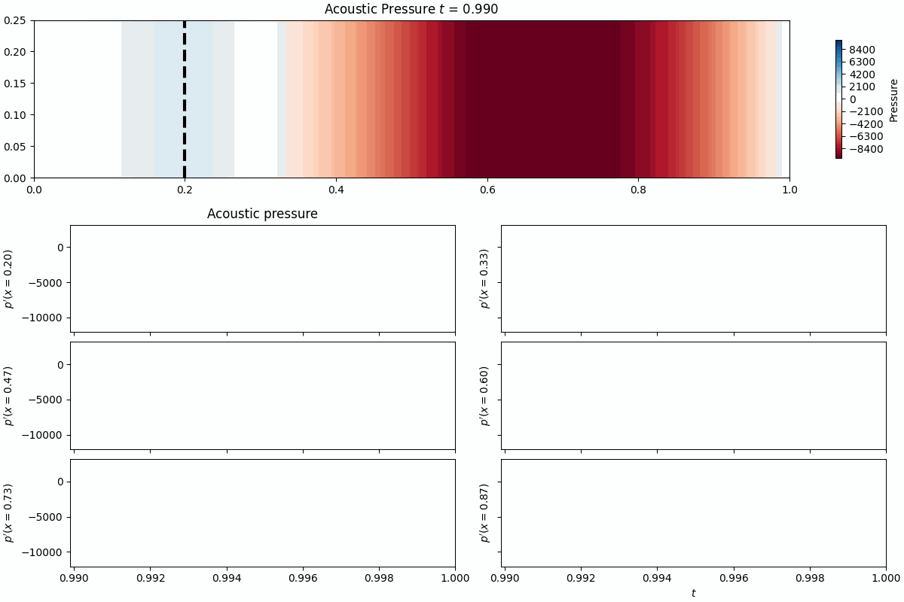

# Physical models

## Summary

**Package:** `dynamodels.physical` (re-exported as `romda.models.physical`). All use `IVPIntegrator` (`scipy.integrate.solve_ivp`) except `KS`, which uses a discrete ETDRK4 map.

| Class | Dim | Key parameters | Integrator |
|---|---|---|---|
| `VdP` | 2 | `beta`, `zeta`, `kappa`, `law`, `omega` | IVP |
| `Lorenz63` | 3 | `rho`, `sigma`, `beta` | IVP |
| `Lorenz96` | Nx | `F`, `Nx` | IVP |
| `KS` | Nx | `nu`, `L`, `Nx` | Discrete (ETDRK4) |
| `Rijke` | 2Nm+Nc | `beta`, `tau`, `C1`, `C2`, `kappa` | IVP |
| `Annular` | 4 | `omega`, `nu`, `c2beta`, `kappa`, `epsilon` | IVP |

------

::: dynamodels.physical.van_der_pol.VdP

::: dynamodels.physical.lorenz63.Lorenz63

<figure markdown>
  { width="650" }
  <figcaption>The Lorenz63 "butterfly" attractor at the chaotic point
  (ρ=28, σ=10, β=8/3), used as a twin-experiment test case for ensemble DA.</figcaption>
</figure>

<figure markdown>
  { width="650" }
  <figcaption>Ergodic exploration of the attractor over time.</figcaption>
</figure>

<figure markdown>
  { width="650" }
  <figcaption>Bifurcations of the long-term state as ρ varies.</figcaption>
</figure>

::: dynamodels.physical.lorenz96.Lorenz96

::: dynamodels.physical.kuramoto_sivashinsky.KS

::: dynamodels.physical.rijke.Rijke

<figure markdown>
  { width="650" }
  <figcaption>Pressure field of the Rijke-tube low-order model.</figcaption>
</figure>

::: dynamodels.physical.annular.Annular

<figure markdown>
  { width="650" }
  <figcaption>Azimuthal thermoacoustic simulation of the annular combustor model
  (ν=20, c₂β=10).</figcaption>
</figure>
