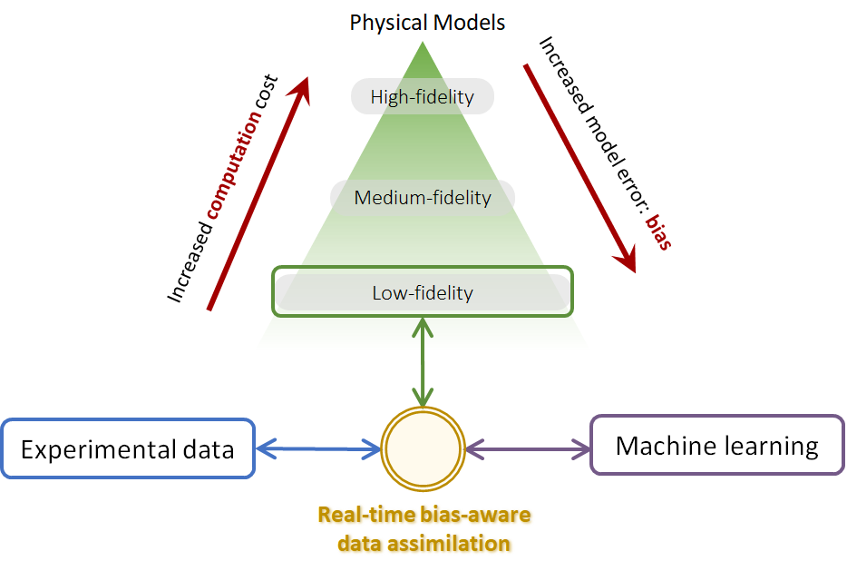

# romda

**Real-time reduced-order modelling and bias-aware data assimilation.**

`romda` is an open-source Python package for combining low-order forecast models with
experimental data in real time. It provides:

- **Ensemble data assimilation** — the ensemble Kalman filter (EnKF), the ensemble
  square-root Kalman filter (EnSRKF), and the **regularized bias-aware EnKF (r-EnKF)**
  of [Nóvoa, Racca & Magri (2023)](https://doi.org/10.1016/j.cma.2023.116502), plus a
  linear Kalman filter.
- **Forecast models** — physical low-order models (Rijke tube, azimuthal
  thermoacoustics, Van der Pol, Lorenz 63/96, Kuramoto–Sivashinsky) and data-driven
  reduced-order models (Echo State Networks and POD-ESN).
- **Bias estimators** — interchangeable models of the (unknown) model bias: an ESN
  estimator, a constant (persistent) bias, and a zero-bias placeholder.
- **Modal decompositions** — POD and spectral POD (Sieber 2016 and Towne 2018) with an
  sklearn-style `fit` / `encode` / `decode` interface.

<figure markdown>
  { width="700" }
  <figcaption>Real-time bias-aware data assimilation: forecast, bias correction,
  assimilation, and update.</figcaption>
</figure>

Model choice trades off accuracy against computational cost — from cheap low-order
physical models to expensive high-fidelity simulations, with data-driven reduced-order
models in between:

<figure markdown>
  { width="600" }
  <figcaption>The source of model bias: physical models trade fidelity for speed.</figcaption>
</figure>

## Quick example

```python
from romda.estimators.ensembles import rBA_EnKF
from romda.models.physical import VdP
from romda.bias_estimators import ConstantBias
from romda.observations import Observations

truth = Observations(model=VdP, t_start=0.6, t_stop=0.8, Nt_obs=30,
                      add_noise=True, manual_bias='linear')

ensemble = rBA_EnKF(parent_model=VdP(dt=truth.dt),
                     parent_bias=ConstantBias,
                     m=10, std_phi=0.1, std_alpha=dict(zeta=(40., 60.)))

for d, t_d in zip(truth.y_obs, truth.t_obs):
    ensemble.forecast_step(t_end=t_d)
    ensemble.analysis_step(d=d, Cdd=...)
```

## Where to start

- [API reference](api/index.md) — the full documented API, starting with the
  [`romda.estimators`](api/estimators.md) hierarchy.

## Citing

If you use `romda` in your research, please cite the relevant publications, in
particular:

> Nóvoa, A., Racca, A., & Magri, L. (2023). Inferring unknown unknowns: Regularized
> bias-aware ensemble Kalman filter. *Computer Methods in Applied Mechanics and
> Engineering*, 418, 116502.


# Class Hierarchy

## Table of Contents

1. [Model](#1-model)
   - 1.1 [HistoryTracker and Integrator](#11-historytracker-and-integrator)
   - 1.2 [Available Models](#12-available-models)
2. [Bias](#2-bias)
   - 2.1 [Forecaster](#21-forecaster)
3. [Estimator](#3-estimator)
   - 3.1 [Available Estimators](#31-available-estimators)
4. [Observations](#4-observations)

---

### 1.2 Available Models

#### Physical models — `dynamodels.physical`

All use `IVPIntegrator` (scipy `solve_ivp`) except KS.

| Class | Dim | Key parameters | Integrator |
|---|---|---|---|
| `Lorenz63` | 3 | `rho`, `sigma`, `beta` | IVP |
| `Lorenz96` | Nx | `F`, `Nx` | IVP |
| `VdP` | 2 | `beta`, `zeta`, `kappa`, `law`, `omega` | IVP |
| `Annular` | 4 | `omega`, `nu`, `c2beta`, `kappa`, `epsilon` | IVP |
| `KS` | Nx | `nu`, `L`, `Nx` | Discrete (ETDRK4) |
| `Rijke` | 2Nm+Nc | `beta`, `tau`, `C1`, `C2`, `kappa` | IVP |

#### Data-driven models — `src/models/data_driven/`

All use `DiscreteIntegrator`. The ML base classes `EchoStateNetwork` (from the external `echostatenetwork` package) and the `Projector` hierarchy (`POD`/`SPOD`, in `src/models/data_driven/autoencoders/` — see [Tools](api/tools.md)) are mixed in via multiple inheritance.

| Class | Key parameters | Notes |
|---|---|---|
| `ESN_model` | `N_units`, `rho`, `sigma_in`, `N_wash` | Inherits `EchoStateNetwork`; requires training `data` at init |
| `POD_ESN` | `N_modes`, `sensor_locations` | Inherits `ESN_model` + `POD`; sensor placement via QR |
| `LinearModel` | `F` (transition matrix), `Q_noise` | `ψ_{t+1} = F @ ψ_t + noise` |

---

## 2. Bias

**File:** `src/bias_estimators/bias.py`

Base class for observation-bias estimators. Mixes in `HistoryTracker`. Wraps a `forecaster` model to produce bias corrections at each assimilation step.

**Key attributes:** `innovation`, `dt`, `forecaster`, `Nq`, `N_dim`, `upsample`, `biased_observations`

Subclasses must implement:
- `init_forecaster(**kwargs)` — build/train the internal forecasting model
- `state_derivative()` — return the Jacobian `J = db/dy` used by bias-aware filters

```
Bias
├── ESN_bias
└── ConstantBias
    └── NoBias
```

| Class | File | Notes |
|---|---|---|
| `ESN_bias` | `src/bias_estimators/esn.py` | Correlation-based training; `biased_observations = True`; the workhorse |
| `ConstantBias` | `src/bias_estimators/constantbias.py` | Fixed bias estimate; `NoBias` subclass for bias-blind DA |

---

### 2.1 Forecaster

The `forecaster` attribute of a `Bias` instance is a `Model` subclass — typically a data-driven model trained on the residual between observations and model output.

```
Bias instance
  .forecaster  →  Model instance   (usually ESN_model)
```

The forecaster is initialised inside `init_forecaster()` and stepped forward in sync with the main model during `Estimator.forecast_step()`. Its output is the predicted bias `b(t)`, which enters the analysis step as a correction to the observation.

---

## 3. Estimator

**File:** `src/estimators/__init__.py`

Abstract base class (ABC) that wraps a `Model` and an optional `Bias` into a full DA loop. Provides the shared `forecast_step()` that advances both the model and the bias in time.

**Key attributes:** `est_phi`, `est_alpha`, `est_bias`, `inflation_factor`, `num_DA_blind`, `num_SE_only`

**Key concrete methods:** `forecast_step()`, `_init_bias()`, `_MA()` (applies measurement operator `M`)

Subclasses must implement:
- `analysis_step(d, Cdd)` — Bayesian update given observation vector `d` and noise covariance `Cdd`

```
Estimator  (ABC)
├── EnsembleEstimator
│   ├── EnKF
│   ├── EnSRKF
│   └── rBA_EnKF
└── DeterministicEstimator
    └── KalmanFilter
```

The relationship between the three main classes — attributes, not subclasses:

```
Estimator instance
  .model  →  Model instance   (used for the forecast)
  .bias   →  Bias instance    (optional; None if bias-unaware)
             .forecaster  →  Model instance   (usually an ESN_model)
```

---

### 3.1 Available Estimators

#### Ensemble estimators — `src/estimators/ensembles.py`

`EnsembleEstimator` is the concrete intermediate base; leaf classes only implement `_analysis_kernel(Af, d, Cdd)`.

**Key attributes:** `m` (ensemble size), `std_phi`, `std_alpha`, `regularization_factor`

| Class | Filter type | Reference |
|---|---|---|
| `EnKF` | Stochastic EnKF (perturbed observations) | Evensen (2003) |
| `EnSRKF` | Deterministic square-root EnKF | Tippett et al. (2003) |
| `rBA_EnKF` | Regularised bias-aware EnKF, weight `γ` | Nóvoa & Magri (2022) |

#### Deterministic estimators — `src/estimators/deterministic.py`

`DeterministicEstimator` owns the state mean `ψ` and covariance `Cpp` directly (no ensemble).

| Class | Notes |
|---|---|
| `KalmanFilter` | Standard linear KF; propagates covariance with Jacobian `F_jac` |


---

## 4. Observations

**File:** `src/observations.py`

Standalone class (no inheritance). Generates or loads ground-truth data, applies a configurable manual bias, adds noise, and exposes observation time indices for the DA loop.

**Key attributes:**

| Attribute | Description |
|---|---|
| `y_true` | Clean biased truth signal `(Nt, Nq, 1)` |
| `y_raw` | Noisy observed signal `(Nt, Nq, 1)` |
| `b_true` | Applied bias `(Nt, Nq, 1)` |
| `t_true` | Full time vector |
| `y_obs`, `t_obs` | Observations at assimilation times |
| `obs_idx` | Indices into `t_true` at which observations are taken |
| `Nt_obs` | Subsampling rate (every `Nt_obs` steps) |

**Noise options** (`noise_type`): `'gauss, add'`, `'gauss, mult'`, coloured noise variants.

**Manual bias options** (`manual_bias`): `'linear'`, `'periodic'`, `'time'`, `'cosine'`, or any callable `f(y_true, t_true) -> (b, name)`.

**Key method:** `plot_truth(case)` — five-panel figure (raw, truth, PDF, PSD, difference).
